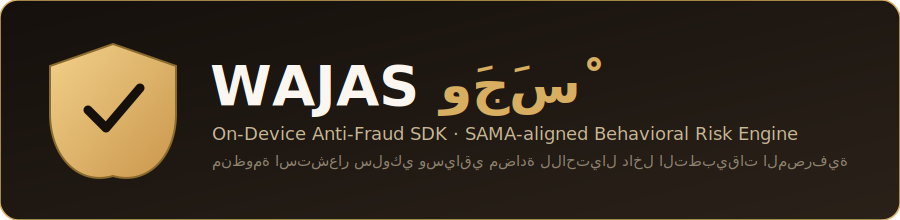

<div align="center">



# منظومة وَجَسْ · Wajas SDK

**Real-time, on-device behavioral anti-fraud SDK for mobile banking apps.**
**منظومة استشعار سلوكي وسياقي فورية، تعمل على الجهاز، لمكافحة الاحتيال في تطبيقات البنوك.**

[](https://www.python.org/)
[](https://streamlit.io/)
[](LICENSE)
[](#)

</div>

---

## 🇬🇧 English

### The Problem

Saudi banking customers lose money every year to **live social-engineering scams**: a fraudster stays on the phone with the victim — impersonating bank support, police, or a delivery service — and talks them into either (a) installing a remote-desktop app like **AnyDesk** or **TeamViewer**, or (b) manually transferring funds while dictating account numbers over the call. Traditional fraud engines that only look at transaction amount, device fingerprint, or velocity **miss this pattern entirely**, because nothing about the transaction itself looks unusual — the victim is the one authorizing it, under duress.

### The Solution

**Wajas (وَجَسْ — Arabic for "a faint sound" or "a subtle sign," evoking quiet, watchful detection)** is a lightweight SDK that runs **on the device**, inside the banking app, and fuses three contextual signals at the moment of a sensitive transaction:

| Signal | What it detects | Status in this repo |
|---|---|---|
| 📞 Active call | Victim is on the phone while transacting | Simulated — see [Architecture](#-technical-architecture) |
| 🖥️ Remote-access software | AnyDesk / TeamViewer / VNC / etc. running | **Real** — live OS process scan via `psutil` |
| ⌨️ Keystroke dynamics | Hesitant, dictation-paced typing | Real analyzer, over a synthesized test feed |

Those three signals feed a rule-based risk engine that applies **proportional friction** instead of a blunt allow/block:

| Risk Score | Tier | Response |
|---|---|---|
| 0 – 39 | ✅ Safe Zone | Transfer proceeds immediately |
| 40 – 70 | ⚠️ Level 1 | Intensive in-app scam-education warning |
| 71 – 85 | ⏳ Level 2 | 5-minute security hold on the transfer |
| 86 – 100 | ⛔ Level 3 | Transaction frozen — mandatory Video-KYC / liveness re-verification |

### 🏗️ Technical Architecture

- **Edge-first / on-device inference.** The scoring engine (`wajas_core.py`) is designed to run inside the app process, not a backend call for every keystroke — this keeps latency near-zero and battery/network cost minimal, which matters for a signal that has to evaluate *before* a transaction confirms.
- **Data minimization by design.** Only a numeric risk score and a coarse signal breakdown (booleans + one float) are meant to ever leave the device — never call audio, screen content, or a full process dump. This is intentionally aligned with SAMA's Cyber Security Framework and PDPL data-minimization principles.
- **What's real vs. simulated in this prototype:**
  - **Remote-desktop detection is real.** `RemoteDesktopDetector` in `wajas_core.py` enumerates the live OS process table with `psutil` and matches against a signature list of ~25 known remote-access tools (AnyDesk, TeamViewer, VNC variants, LogMeIn, ScreenConnect, etc.).
  - **Active-call detection is simulated**, because a desktop Python process has no access to a phone's cellular/VoIP call state. A production build hooks `CXCallObserver` (CallKit) on iOS or `TelephonyManager`/`PhoneStateListener` on Android — see the docstring in `CallDetector` for the exact native APIs.
  - **Keystroke-dynamics scoring is a real, deterministic algorithm** (mean inter-key latency, jitter, long-pause count) — it just runs against a synthetic timestamp feed here, because true per-keystroke timing needs a native text-field hook that a browser-rendered demo UI can't provide. Swap the input source; the analyzer doesn't change.
- **Defense in depth.** Proportional friction avoids permanently blocking genuine customers on a false positive, while high-confidence sessions are hard-stopped pending strong re-proof of identity — aligned with SAMA's e-KYC guidance on step-up biometric verification for high-risk events.

### 🚀 Quick Start

```bash
# 1. Clone the repo
git clone https://github.com/<your-username>/wajas-sdk.git
cd wajas-sdk

# 2. Create a virtual environment (recommended)
python -m venv venv
venv\Scripts\activate        # Windows
# source venv/bin/activate   # macOS / Linux

# 3. Install dependencies
pip install -r requirements.txt

# 4. Run the interactive dashboard
streamlit run app.py

# (optional) Run the SDK core standalone, no UI — proves the real
# process scan works on your machine:
python wajas_core.py
```

### 🇸🇦 Arabic UI (النسخة العربية)

A full Arabic, right-to-left version of the dashboard ships alongside the English one — same real detection engine underneath, translated user-facing text and mitigation copy.

```bash
streamlit run app_ar.py      # لوحة الاختبار بالعربية (RTL)
python wajas_core_ar.py      # اختبار ذاتي مستقل للمحرك بالعربية
```

`wajas_core_ar.py` does not duplicate the risk math — it subclasses `WajasSDK` from `wajas_core.py` and only translates the user-facing breakdown reasons and audit-log text, so both language versions share one source of truth for scoring.

### 🔌 Integrate in One Line

```python
from wajas_core import assess

result = assess(call_active=True, amount=15000)

if result.decision == "FREEZE":
    block_transaction_and_start_kyc()
elif result.decision == "HOLD":
    apply_security_delay(minutes=5)
elif result.decision == "WARN":
    show_scam_education_popup()
else:
    approve_transaction()
```

`assess()` auto-runs a real remote-desktop scan when `remote_desktop` isn't passed explicitly, so most integrations need nothing more than the snippet above.

### 📁 Repository Structure

```
wajas-sdk/
├── wajas_core.py       # The SDK: detectors, risk engine, public API (English text)
├── wajas_core_ar.py    # Arabic text layer, subclasses WajasSDK — same scoring logic
├── app.py              # Streamlit testing sandbox / demo dashboard (English, LTR)
├── app_ar.py           # Streamlit testing sandbox / demo dashboard (Arabic, RTL)
├── requirements.txt
├── assets/
│   └── logo.svg
├── LICENSE
└── README.md
```

### ⚠️ Disclaimer

This is a hackathon MVP / logic simulator, not a certified or production-audited system. It is conceptually aligned with SAMA's Cyber Security Framework and e-KYC guidance but has not been formally reviewed against them. No real funds, PII, or banking systems are involved.

---

## 🇸🇦 العربية

### المشكلة

يخسر عملاء البنوك في المملكة أموالًا كل عام بسبب **عمليات احتيال اجتماعي حي (Social Engineering)**: يبقى المحتال على الهاتف مع الضحية — منتحلًا صفة الدعم البنكي أو الجهات الأمنية — ويقنعه إما بتثبيت تطبيق تحكم عن بُعد مثل **AnyDesk** أو **TeamViewer**، أو بتحويل الأموال يدويًا أثناء إملاء أرقام الحسابات هاتفيًا. أنظمة مكافحة الاحتيال التقليدية التي تعتمد فقط على مبلغ العملية أو بصمة الجهاز **لا ترصد هذا النمط إطلاقًا**، لأن العملية نفسها تبدو طبيعية طالما أن الضحية هو من يوافق عليها.

### الحل

**وَجَسْ** — كلمة عربية تعني الصوت الخفي أو الإشارة الدقيقة، في إشارة إلى الرصد الهادئ واليقظ — هي حزمة برمجية خفيفة (SDK) تعمل **على الجهاز نفسه**، داخل تطبيق البنك، وتدمج ثلاث إشارات سياقية لحظة تنفيذ عملية حساسة:

| الإشارة | ما الذي ترصده | الحالة في هذا المستودع |
|---|---|---|
| 📞 مكالمة نشطة | الضحية على الهاتف أثناء تنفيذ العملية | محاكاة — راجع قسم البنية التقنية |
| 🖥️ برامج التحكم عن بُعد | تشغيل AnyDesk / TeamViewer / VNC وغيرها | **حقيقي** — فحص فعلي للعمليات عبر `psutil` |
| ⌨️ ديناميكية الكتابة | كتابة متردّدة بوتيرة الإملاء | تحليل حقيقي، على بيانات اختبار مولّدة |

تُغذّي هذه الإشارات محرك مخاطر قائم على القواعد يطبّق **احتكاكًا تدريجيًا** بدلاً من الحظر أو السماح المطلق:

| درجة الخطورة | المستوى | الإجراء |
|---|---|---|
| 0 – 39 | ✅ منطقة آمنة | تنفيذ التحويل فورًا |
| 40 – 70 | ⚠️ المستوى الأول | تنبيه توعوي مكثف داخل التطبيق |
| 71 – 85 | ⏳ المستوى الثاني | تعليق أمني للتحويل لمدة 5 دقائق |
| 86 – 100 | ⛔ المستوى الثالث | تجميد العملية وإلزام بالتحقق بالفيديو (Video-KYC) |

### ملاحظة هامة

هذا المشروع نموذج أولي (MVP) لهاكاثون ومحاكي منطقي، وليس نظامًا معتمدًا أو مدققًا للإنتاج. تم تصميمه بما يتماشى من الناحية المفاهيمية مع إطار الأمن السيبراني الصادر عن البنك المركزي السعودي (ساما) وإرشادات التحقق الرقمي من الهوية (e-KYC)، دون أن يخضع لمراجعة رسمية بموجبها. لا يتضمن المشروع أي أموال أو بيانات شخصية حقيقية أو اتصالًا بأنظمة بنكية فعلية.

---

<div align="center">
<sub>Built for a hackathon demo · منظومة وَجَسْ — لأن الحماية تبدأ بإشارة خفية</sub>
</div>
